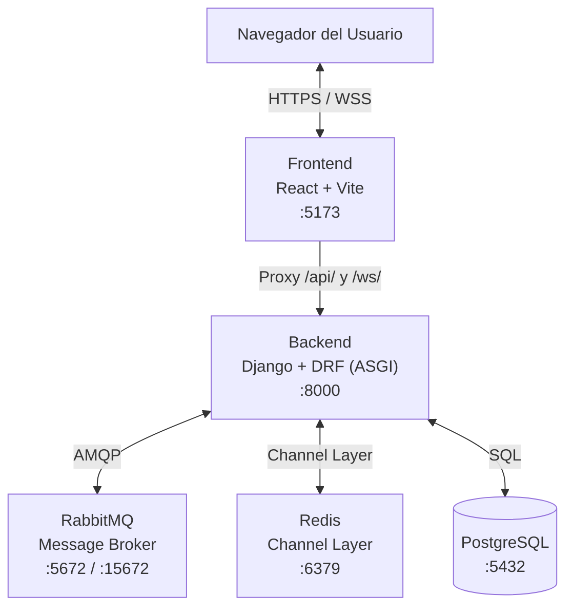
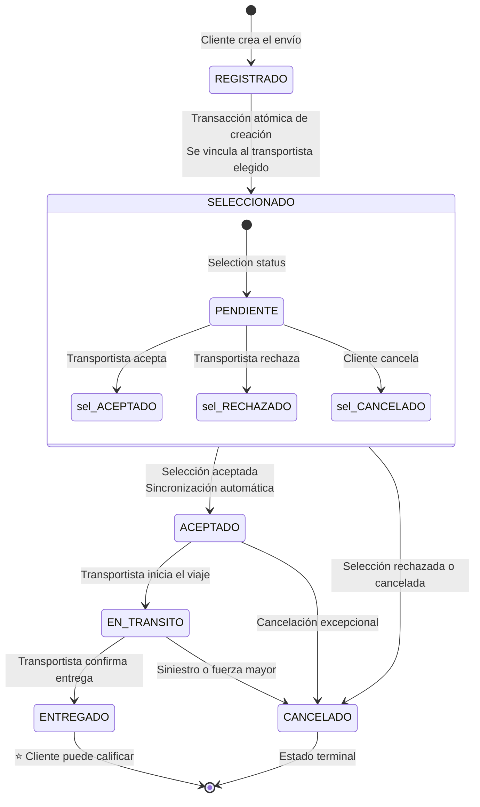

# 📦 SIS_ENV_TRANS — Plataforma de Coordinación y Seguimiento de Envíos de Carga

> **CargoDistrict** es una plataforma web de logística que permite a **clientes** registrar envíos de carga, seleccionar **transportistas** disponibles, y dar seguimiento en tiempo real al estado de cada envío, todo respaldado por un sistema de eventos, notificaciones y calificaciones.

---

## 📑 Tabla de Contenidos

1. [Descripción General](#-descripción-general)
2. [Arquitectura del Sistema](#-arquitectura-del-sistema)
3. [Stack Tecnológico](#-stack-tecnológico)
4. [Estructura del Proyecto](#-estructura-del-proyecto)
5. [Requisitos Previos](#-requisitos-previos)
6. [Instalación y Configuración](#-instalación-y-configuración)
   - [1. Clonar el repositorio](#1-clonar-el-repositorio)
   - [2. Configurar el Backend](#2-configurar-el-backend)
   - [3. Configurar el Frontend](#3-configurar-el-frontend)
7. [Ejecución del Proyecto](#-ejecución-del-proyecto)
8. [Base de Datos](#-base-de-datos)
9. [Endpoints de la API](#-endpoints-de-la-api)
10. [WebSockets (Tiempo Real)](#-websockets-tiempo-real)
11. [Roles del Sistema](#-roles-del-sistema)
12. [Flujo del Envío (Ciclo de Vida)](#-flujo-del-envío-ciclo-de-vida)
13. [Variables de Entorno](#-variables-de-entorno)

---

## 🌐 Descripción General

**SIS_ENV_TRANS** (Sistema de Envíos y Transporte) es una aplicación fullstack diseñada como proyecto de Sistemas Distribuidos. La plataforma conecta a clientes que necesitan enviar carga con transportistas que ofrecen sus servicios, proporcionando:

- **Registro y autenticación** de usuarios (manual + Google OAuth).
- **Gestión de envíos**: creación, selección de transportista, aceptación/rechazo, tránsito y entrega.
- **Tracking en tiempo real** vía WebSockets (Django Channels + Redis).
- **Sistema de eventos** con message broker (RabbitMQ) para notificaciones asíncronas.
- **Calificaciones** post-entrega para evaluar transportistas.
- **Subida de imágenes** de los paquetes a Cloudinary.
- **PWA (Progressive Web App)** para acceso móvil.

---

## 🏗 Arquitectura del Sistema



---

## 🛠 Stack Tecnológico

### Backend
| Tecnología | Versión | Propósito |
|---|---|---|
| Python | 3.12+ | Lenguaje principal |
| Django | 6.0.5 | Framework web |
| Django REST Framework | 3.17.1 | API REST |
| Django Channels | 4.3.2 | WebSockets / ASGI |
| PostgreSQL | 16 | Base de datos relacional |
| RabbitMQ | 3-management | Message broker (eventos) |
| Redis | 7-alpine | Channel layer (WebSockets) |
| SimpleJWT | 5.3.1 | Autenticación JWT |
| Cloudinary | 1.44.2 | Almacenamiento de imágenes |
| Pika | 1.3.2 | Cliente AMQP (RabbitMQ) |

### Frontend
| Tecnología | Versión | Propósito |
|---|---|---|
| React | 18.3.1 | Biblioteca UI |
| Vite | 6.3.5 | Bundler / Dev server |
| TypeScript | — | Tipado estático |
| TailwindCSS | 4.1.12 | Framework CSS |
| Radix UI | — | Componentes accesibles (Primitives) |
| MUI (Material UI) | 7.3.5 | Componentes adicionales |
| Zustand | 5.x | Gestión de estado global |
| React Router | 7.13.0 | Enrutamiento SPA |
| React Hook Form | 7.55.0 | Manejo de formularios |
| Recharts | 2.15.2 | Gráficos y visualizaciones |
| Sonner | 2.0.3 | Notificaciones toast |
| Motion (Framer) | 12.23.24 | Animaciones |
| pnpm | — | Gestor de paquetes |

---

## 📁 Estructura del Proyecto

```
SIS_ENV_TRANS/
├── Docs/                          # Documentación del proyecto
├── backend/
│   ├── .env.example               # Plantilla de variables de entorno
│   ├── .env                       # Variables de entorno (NO versionado)
│   ├── .env.production            # Variables para producción
│   ├── docker/
│   │   └── docker-compose.yml     # PostgreSQL + RabbitMQ + Redis
│   └── server/
│       ├── manage.py              # CLI de Django
│       ├── config/
│       │   ├── settings/
│       │   │   ├── base.py        # Configuración compartida
│       │   │   ├── development.py # Config desarrollo
│       │   │   └── production.py  # Config producción
│       │   ├── urls.py            # Rutas principales
│       │   ├── asgi.py            # Punto de entrada ASGI
│       │   └── wsgi.py            # Punto de entrada WSGI
│       ├── apps/
│       │   ├── users/             # Autenticación, registro, Google OAuth
│       │   ├── clients/           # Perfil y gestión de clientes
│       │   ├── transporters/      # Perfil y gestión de transportistas
│       │   ├── shipments/         # CRUD envíos, selecciones, tracking, WS
│       │   ├── ratings/           # Calificaciones post-entrega
│       │   ├── events/            # Sistema de eventos del dominio
│       │   └── notifications/     # Notificaciones (consumer RabbitMQ)
│       ├── common/
│       │   ├── enums/             # Enumerados compartidos
│       │   └── messaging/         # Publisher RabbitMQ
│       └── requirements/
│           ├── base.txt           # Dependencias Python
│           └── prod.txt           # Dependencias producción
│
└── frontend/
    ├── .env.example               # Plantilla de variables de entorno
    ├── package.json               # Dependencias y scripts
    ├── pnpm-lock.yaml             # Lock file de pnpm
    ├── vite.config.ts             # Configuración de Vite + Proxy
    ├── index.html                 # Punto de entrada HTML
    ├── public/                    # Assets estáticos
    └── src/
        ├── main.tsx               # Bootstrap React
        ├── styles/                # Estilos globales
        └── app/
            ├── App.tsx            # Componente raíz
            ├── routes.tsx         # Definición de rutas
            ├── components/
            │   ├── landing-page.tsx
            │   ├── auth-page.tsx
            │   ├── profile.tsx
            │   ├── client/        # Vistas del cliente
            │   │   ├── client-dashboard.tsx
            │   │   ├── new-shipment.tsx
            │   │   ├── tracking.tsx
            │   │   └── RatingModal.tsx
            │   ├── transporter/   # Vistas del transportista
            │   │   └── transporter-dashboard.tsx
            │   ├── layout/        # Layouts compartidos
            │   └── ui/            # Componentes UI reutilizables
            ├── stores/            # Zustand stores
            │   ├── useNotificationStore.ts
            │   ├── useShipmentListStore.ts
            │   └── useShipmentStore.ts
            ├── hooks/             # Custom hooks
            ├── context/           # Contextos React
            ├── lib/               # Utilidades
            └── types/             # Tipos TypeScript
```

---

## ✅ Requisitos Previos

Asegúrate de tener instalado lo siguiente antes de continuar:

| Herramienta | Versión mínima | Instalación |
|---|---|---|
| **Git** | 2.x | [git-scm.com](https://git-scm.com/) |
| **Docker** | 24.x | [docs.docker.com](https://docs.docker.com/get-docker/) |
| **Docker Compose** | 2.x | Incluido con Docker Desktop |
| **Python** | 3.12+ | [python.org](https://www.python.org/) |
| **Node.js** | 18+ | [nodejs.org](https://nodejs.org/) |
| **pnpm** | 8+ | `npm install -g pnpm` |

> **Nota:** Se recomienda usar un sistema Linux o WSL2 en Windows para una mejor compatibilidad con Docker y los servicios.

---

## 🚀 Instalación y Configuración

### 1. Clonar el repositorio

```bash
git clone https://github.com/<tu-usuario>/SIS_ENV_TRANS.git
cd SIS_ENV_TRANS
```

---

### 2. Configurar el Backend

#### 2.1 Levantar los servicios con Docker

Los servicios de infraestructura (**PostgreSQL**, **RabbitMQ** y **Redis**) se administran con Docker Compose.

```bash
# Copiar la plantilla de variables de entorno
cp backend/.env.example backend/.env
```

Edita `backend/.env` y completa **todas** las variables:

```ini
# Base de Datos PostgreSQL
DB_USER=postgres
DB_NAME=sis_env_trans
DB_PASSWORD=tu_password_seguro
DB_PORT=5432
DB_HOST=localhost

# Django
SECRET_KEY=tu-clave-secreta-aqui
DEBUG=True
ALLOWED_HOSTS=localhost,127.0.0.1
DJANGO_SETTINGS_MODULE=config.settings.development

# Google OAuth (opcional para desarrollo)
GOOGLE_OAUTH_CLIENT_ID=tu-client-id
GOOGLE_OAUTH_SECRET=tu-secret

# RabbitMQ
RABBITMQ_HOST=localhost
RABBITMQ_PORT=5672
RABBITMQ_USER=guest
RABBITMQ_PASS=guest
RABBITMQ_MGMT_PORT=15672

# Cloudinary (subida de imágenes)
CLOUDINARY_CLOUD_NAME=tu-cloud-name
CLOUDINARY_API_KEY=tu-api-key
CLOUDINARY_API_SECRET=tu-api-secret

# Redis (Channel Layer para WebSockets)
REDIS_HOST=localhost
REDIS_PORT=6379
```

Ahora levanta los contenedores:

```bash
docker compose --env-file backend/.env -f backend/docker/docker-compose.yml up -d
```

Verifica que estén corriendo:

```bash
docker ps
```

Deberías ver 3 contenedores activos:
- `postgres-db` en el puerto configurado
- `rabbitmq` en puertos 5672 y 15672
- `redis` en puerto 6379

> 💡 **Panel de RabbitMQ:** accede a `http://localhost:15672` con las credenciales configuradas (`guest/guest` por defecto).

#### 2.2 Configurar el entorno virtual de Python

```bash
cd backend/server

# Crear entorno virtual
python3 -m venv venv

# Activar el entorno virtual
source venv/bin/activate        # Linux / macOS
# venv\Scripts\activate         # Windows (PowerShell)

# Instalar dependencias
pip install -r requirements/base.txt
```

#### 2.3 Aplicar migraciones de Django

```bash
cd backend/server

# Generar migraciones
python manage.py makemigrations

# Aplicar migraciones
python manage.py migrate
```

#### 2.4 Crear un superusuario (opcional)

```bash
python manage.py createsuperuser
```

---

### 3. Configurar el Frontend

#### 3.1 Instalar dependencias

```bash
cd frontend

# Copiar la plantilla de variables de entorno
cp .env.example .env
```

Edita `frontend/.env`:

```ini
VITE_GOOGLE_CLIENT_ID=tu-google-client-id
VITE_GOOGLE_OAUTH_SECRET=tu-google-secret
VITE_API_URL_BACKEND=http://127.0.0.1:8000/
```

Instala las dependencias con pnpm:

```bash
pnpm install
```

---

## ▶ Ejecución del Proyecto

> ⚠️ **Importante:** Asegúrate de que los contenedores Docker (PostgreSQL, RabbitMQ, Redis) estén corriendo antes de iniciar el backend.

### Terminal 1 — Backend (Django)

```bash
cd backend/server
source venv/bin/activate

python manage.py runserver
```

> El servidor de desarrollo de Django se iniciará en `http://localhost:8000`.

### Terminal 2 — Consumer de Notificaciones (RabbitMQ)

```bash
cd backend/server
source venv/bin/activate

python manage.py rabbitmq_consumer
```

> Este comando inicia el consumer que escucha eventos de RabbitMQ y genera notificaciones.

### Terminal 3 — Frontend (Vite)

```bash
cd frontend
pnpm run dev
```

El frontend estará disponible en: **http://localhost:5173**

El proxy de Vite redirige automáticamente:
- `/api/*` → `http://127.0.0.1:8000` (REST API)
- `/ws/*` → `ws://127.0.0.1:8000` (WebSockets)

---

## 🗄 Base de Datos

La base de datos PostgreSQL contiene las siguientes tablas principales:

| Tabla | Descripción |
|---|---|
| `users` | Usuarios base (email, password, role) |
| `user_social_accounts` | Cuentas vinculadas (Google OAuth) |
| `clients` | Perfil extendido de clientes |
| `transporters` | Perfil extendido de transportistas |
| `transporter_zones` | Zonas de cobertura de transportistas |
| `shipments` | Envíos de carga |
| `shipment_selections` | Selección de transportista por envío |
| `shipment_tracking` | Historial de seguimiento (inmutable) |
| `ratings` | Calificaciones post-entrega |
| `system_events` | Eventos del dominio (publicados a RabbitMQ) |
| `notifications` | Notificaciones generadas por eventos |

### Tipos Enumerados

- **`user_role`**: `CLIENT`, `TRANSPORTER`, `ADMIN`
- **`shipment_status`**: `REGISTRADO` → `SELECCIONADO` → `ACEPTADO` → `EN_TRANSITO` → `ENTREGADO` | `CANCELADO`
- **`selection_status`**: `PENDIENTE`, `ACEPTADO`, `CANCELADO`, `RECHAZADO`
- **`event_type`**: `SHIPMENT_CREATED`, `TRANSPORTER_SELECTED`, `SHIPMENT_ACCEPTED`, `SHIPMENT_REJECTED`, `SHIPMENT_IN_TRANSIT`, `SHIPMENT_DELIVERED`, `SHIPMENT_CANCELLED`
- **`notification_channel`**: `SISTEMA`, `EMAIL`, `SMS`

---

## 🔌 Endpoints de la API

**Base URL:** `http://localhost:8000/api/`

**Autenticación:** JWT Bearer Token (`Authorization: Bearer <access_token>`)

### Autenticación (`apps.users`)

| Método | Ruta | Descripción | Auth |
|---|---|---|---|
| `POST` | `/api/auth/register/client/` | Registrar cliente | ❌ |
| `POST` | `/api/auth/register/transporter/` | Registrar transportista | ❌ |
| `POST` | `/api/auth/login/` | Iniciar sesión | ❌ |
| `POST` | `/api/auth/callback/google/` | Login con Google OAuth | ❌ |

### Clientes (`apps.clients`)

| Método | Ruta | Descripción | Auth |
|---|---|---|---|
| `GET` | `/api/clients/` | Listar clientes | ✅ Admin |
| `GET` | `/api/clients/{id}/` | Detalle de cliente | ✅ |
| `PATCH` | `/api/clients/{id}/` | Actualizar parcial | ✅ |
| `PUT` | `/api/clients/{id}/` | Actualizar completo | ✅ |

### Transportistas (`apps.transporters`)

| Método | Ruta | Descripción | Auth |
|---|---|---|---|
| `GET` | `/api/transporters/` | Listar transportistas | ✅ Admin |
| `GET` | `/api/transporters/{id}/` | Detalle de transportista | ✅ |
| `PATCH` | `/api/transporters/{id}/` | Actualizar parcial | ✅ |
| `PUT` | `/api/transporters/{id}/` | Actualizar completo | ✅ |

### Envíos (`apps.shipments`)

| Método | Ruta | Descripción | Auth |
|---|---|---|---|
| `GET` | `/api/shipments/` | Listar envíos | ✅ |
| `POST` | `/api/shipments/` | Crear envío | ✅ Cliente |
| `GET` | `/api/shipments/{id}/` | Detalle de envío | ✅ |
| `PATCH` | `/api/shipments/{id}/` | Actualizar envío | ✅ |
| `POST` | `/api/shipments/{id}/select/` | Seleccionar transportista | ✅ Cliente |
| `POST` | `/api/shipments/{id}/accept/` | Aceptar envío | ✅ Transportista |
| `POST` | `/api/shipments/{id}/reject/` | Rechazar envío | ✅ Transportista |
| `POST` | `/api/shipments/{id}/in-transit/` | Marcar en tránsito | ✅ Transportista |
| `POST` | `/api/shipments/{id}/deliver/` | Marcar entregado | ✅ Transportista |
| `POST` | `/api/shipments/{id}/cancel/` | Cancelar envío | ✅ |

### Calificaciones (`apps.ratings`)

| Método | Ruta | Descripción | Auth |
|---|---|---|---|
| `POST` | `/api/ratings/` | Crear calificación | ✅ Cliente |
| `GET` | `/api/ratings/` | Listar calificaciones | ✅ |

### Eventos (`apps.events`)

| Método | Ruta | Descripción | Auth |
|---|---|---|---|
| `GET` | `/api/events/` | Listar eventos del sistema | ✅ Admin |

### Notificaciones (`apps.notifications`)

| Método | Ruta | Descripción | Auth |
|---|---|---|---|
| `GET` | `/api/notifications/` | Listar notificaciones | ✅ |

---

## 🔄 WebSockets (Tiempo Real)

El sistema utiliza **Django Channels** con **Redis** como channel layer para notificaciones y tracking en tiempo real.

### Conexión WebSocket

```
ws://localhost:8000/ws/shipments/?token=<access_token>
```

La autenticación se realiza mediante un **JWT** enviado como query parameter. El middleware `JWTAuthMiddleware` valida el token antes de permitir la conexión.

### Eventos recibidos por WebSocket

Los clientes y transportistas reciben actualizaciones en tiempo real cuando:

- Se crea un nuevo envío
- Un transportista es seleccionado
- Un envío es aceptado o rechazado
- El estado cambia a "en tránsito" o "entregado"
- Se cancela un envío

---

## 👥 Roles del Sistema

### 🧑 Cliente (`CLIENT`)
- Registrar envíos de carga con imágenes
- Seleccionar un transportista para su envío
- Dar seguimiento en tiempo real
- Calificar al transportista tras la entrega
- Cancelar envíos

### 🚛 Transportista (`TRANSPORTER`)
- Ver envíos disponibles y solicitudes de selección
- Aceptar o rechazar solicitudes
- Actualizar el estado del envío (en tránsito, entregado)
- Gestionar su perfil y disponibilidad

### 🛡 Administrador (`ADMIN`)
- Gestionar todos los usuarios
- Acceder a todos los endpoints
- Consultar eventos del sistema

---

## 🔄 Flujo del Envío (Ciclo de Vida)



---

## 🔐 Variables de Entorno

### Backend (`backend/.env`)

| Variable | Descripción | Ejemplo |
|---|---|---|
| `DB_USER` | Usuario de PostgreSQL | `postgres` |
| `DB_NAME` | Nombre de la base de datos | `sis_env_trans` |
| `DB_PASSWORD` | Contraseña de PostgreSQL | `mypassword` |
| `DB_PORT` | Puerto de PostgreSQL | `5432` |
| `DB_HOST` | Host de PostgreSQL | `localhost` |
| `SECRET_KEY` | Clave secreta de Django | `django-insecure-...` |
| `DEBUG` | Modo debug | `True` |
| `ALLOWED_HOSTS` | Hosts permitidos | `localhost,127.0.0.1` |
| `DJANGO_SETTINGS_MODULE` | Módulo de settings | `config.settings.development` |
| `GOOGLE_OAUTH_CLIENT_ID` | Client ID de Google | `xxxx.apps.googleusercontent.com` |
| `GOOGLE_OAUTH_SECRET` | Secret de Google OAuth | `GOCSPX-...` |
| `RABBITMQ_HOST` | Host de RabbitMQ | `localhost` |
| `RABBITMQ_PORT` | Puerto AMQP | `5672` |
| `RABBITMQ_USER` | Usuario de RabbitMQ | `guest` |
| `RABBITMQ_PASS` | Contraseña de RabbitMQ | `guest` |
| `RABBITMQ_MGMT_PORT` | Puerto panel de gestión | `15672` |
| `CLOUDINARY_CLOUD_NAME` | Nombre del cloud Cloudinary | `my-cloud` |
| `CLOUDINARY_API_KEY` | API Key de Cloudinary | `123456789` |
| `CLOUDINARY_API_SECRET` | API Secret de Cloudinary | `abcdef...` |
| `REDIS_HOST` | Host de Redis | `localhost` |
| `REDIS_PORT` | Puerto de Redis | `6379` |

### Frontend (`frontend/.env`)

| Variable | Descripción | Ejemplo |
|---|---|---|
| `VITE_GOOGLE_CLIENT_ID` | Client ID de Google OAuth | `xxxx.apps.googleusercontent.com` |
| `VITE_GOOGLE_OAUTH_SECRET` | Secret de Google OAuth | `GOCSPX-...` |
| `VITE_API_URL_BACKEND` | URL base del backend | `http://127.0.0.1:8000/` |

---

## 📝 Notas Adicionales

- El frontend utiliza un **proxy de Vite** en desarrollo, por lo que las peticiones a `/api/` y `/ws/` se redirigen automáticamente al backend en el puerto 8000.
- Las imágenes de los envíos se suben a **Cloudinary** mediante uploads firmados (signed uploads).
- El sistema de eventos usa **RabbitMQ** como message broker: cuando ocurre un cambio de estado en un envío, se publica un evento que es consumido por el management command `consume_notifications` para generar notificaciones.
- Las tokens JWT tienen un **tiempo de vida de 15 minutos** (access) y **7 días** (refresh).
- El throttling de autenticación está configurado a **10 solicitudes por minuto**.
- La aplicación frontend es una **PWA** y puede ser instalada en dispositivos móviles.

---

> **Proyecto académico** — Sistemas Distribuidos, Semestre VII
